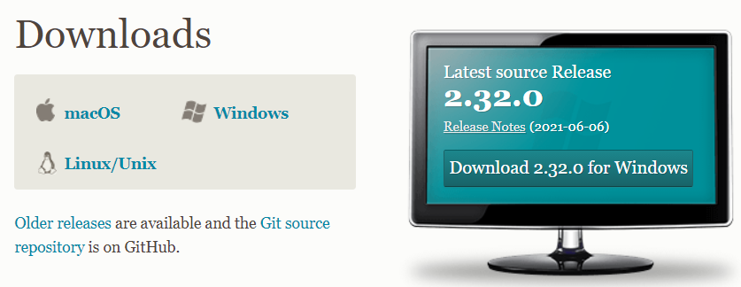

## 1. 깃 다운로드

- 깃 홈페이지에서 자신의 OS에 맞는 설치파일을 다운로드 한다. (Window 설치함)



- 설치 과정은 기본셋팅을 건드리지 않고 Next 만 눌렀다.
- 깃의 기본 에디터는 Git default editor 선택. 만일 주요 사용하는 에디터(vscode, notedpad..)가 있다면 해당 에디터로 선택하는 것을 추천
- 'Let Git decide' 를 체크하고 Next만 계속 누른 뒤 Install!

## 2. Git Bash 실행

- git bash 실행하기

1. 사용자 등록

```c
git config --global user.name"name" //"name"에는 자신의 git username 작성

git config --global user.email "user@email.com" //"email"에 자신의 git가입 메일 작성
```

1. 확인

```c
git status //현재 상태 확인 
```

1. git clone 사용하기

- 팀원이 Repository 를 생성해 줘서 링크 타고 들어갔다.
- (Fork를 지금 하니까 커밋이 안되어서 나중에 하기로함..!)
- git 에서 팀원이 보낸 invitation 메일 승인 하고 git clone을 시작.

1. http 프로토콜로 git저장소 clone 하기

바탕화면에 우클릭 한 후 git bash 선택하여 창 열어 명령어 작성.

```c
git clone <https://github.com/~~~~~/~~~~~.git>  

//https~ 부분은 생성된 코드의 https를 복사하여 붙여 넣는다. 
```

1. 파일이 생성되면 내 파일에 들어가서 기본 index.txt 파일을 수정하였다.

커밋이 작동되는지 확인차 한거라 우선 아무거나 작성해도 상관 없다.

1. 생성된 파일 내에서 git bash 를 켠다

켠 후 다음과 같이 명령어 작성

```c
git add .  

// 뒤의 . 은 모든 파일을 추가한다는 뜻. 
//add를 하면 commit을 할 수 있는 상태가 되는 것이다.

git commit -m "변경기록" 
// -m 은 메세지를 의미한다. "//" 안에 커밋할때 보이는 메세지를 작성하면 된다.

git push origin master
// push하면 git에 올리기 완료!!
```

### 트러블 슈팅..이라고 하기엔 애매한 오류

- git push 하고 엔터를 치니 밑에 커서만 깜빡이고 아무 변화가 없었다.

- pull 도 해보고, clone 다시 만들기도 몇번이나 해봤지만 무용지물

- 노트북도 껐다 켜봤지만 해결되지 않은 문제....

- 역시 구글이 답을 줬다.

  https://www.codeit.kr/community/threads/28278

  1. cmd창을 켠 후 'cd 파일명' 으로 해당 클론 파일에 들어간다.
  2. 해당 파일에 들어왔으면 동일하게 git push -u origin main 작성
  3. 엔터치면  1.  인터넷 연결 승인 ~어쩌구  / 2.  개인 승인 어쩌구~  가 뜬다.
  4. 1 치고 엔터!!!!
  5. 이제 git에서 나의 계정을 드디어 승인하는 듯이 아이디/비밀번호 입력창이 나온다.
  6. 로그인 후 다시 돌아가서 git bash에서 push!!!!!성공!!!!

- 알고리즘 팀원들이 30분 넘게 해결하지 못했고 아직 원인도 잘 모르겠다. 왜 도스창에서만 되는거지, 내 윈도우 설정이 이상한가..??

  아마, bash가 관리자 권한이 없어서 깃허브 로그인창을 못띄운 것 같다는 피드백이 있었다.

  나중에 git에 대해 잘 아는 사람이 있으면 나좀 알려주소!!!!

  - 구글링하다 나온 알아두면 좋은것

    제거 명령어 ⇒  rm -rm '폴더명'

- 설치 과정은 기본셋팅을 건드리지 않고 Next 만 눌렀다.
- 깃의 기본 에디터는 Git default editor 선택. 만일 주요 사용하는 에디터(vscode, notedpad..)가 있다면 해당 에디터로 선택하는 것을 추천
- 'Let Git decide' 를 체크하고 Next만 계속 누른 뒤 Install!

## 2. Git Bash 실행

- git bash 실행하기

1. 사용자 등록

```c
git config --global user.name"name" //"name"에는 자신의 git username 작성

git config --global user.email "user@email.com" //"email"에 자신의 git가입 메일 작성
```

1. 확인

```c
git status //현재 상태 확인 
```

1. git clone 사용하기

- 팀원이 Repository 를 생성해 줘서 링크 타고 들어갔다.
- (Fork를 지금 하니까 커밋이 안되어서 나중에 하기로함..!)
- git 에서 팀원이 보낸 invitation 메일 승인 하고 git clone을 시작.

1. http 프로토콜로 git저장소 clone 하기

바탕화면에 우클릭 한 후 git bash 선택하여 창 열어 명령어 작성.

```c
git clone <https://github.com/~~~~~/~~~~~.git>  

//https~ 부분은 생성된 코드의 https를 복사하여 붙여 넣는다. 
```

1. 파일이 생성되면 내 파일에 들어가서 기본 index.txt 파일을 수정하였다.

커밋이 작동되는지 확인차 한거라 우선 아무거나 작성해도 상관 없다.

1. 생성된 파일 내에서 git bash 를 켠다

켠 후 다음과 같이 명령어 작성

```c
git add .  

// 뒤의 . 은 모든 파일을 추가한다는 뜻. 
//add를 하면 commit을 할 수 있는 상태가 되는 것이다.

git commit -m "변경기록" 
// -m 은 메세지를 의미한다. "//" 안에 커밋할때 보이는 메세지를 작성하면 된다.

git push origin master
// push하면 git에 올리기 완료!!
```

### 트러블 슈팅..이라고 하기엔 애매한 오류

- git push 하고 엔터를 치니 밑에 커서만 깜빡이고 아무 변화가 없었다.

- pull 도 해보고, clone 다시 만들기도 몇번이나 해봤지만 무용지물

- 노트북도 껐다 켜봤지만 해결되지 않은 문제....

- 역시 구글이 답을 줬다.

  https://www.codeit.kr/community/threads/28278

  1. cmd창을 켠 후 'cd 파일명' 으로 해당 클론 파일에 들어간다.
  2. 해당 파일에 들어왔으면 동일하게 git push -u origin main 작성
  3. 엔터치면  1.  인터넷 연결 승인 ~어쩌구  / 2.  개인 승인 어쩌구~  가 뜬다.
  4. 1 치고 엔터!!!!
  5. 이제 git에서 나의 계정을 드디어 승인하는 듯이 아이디/비밀번호 입력창이 나온다.
  6. 로그인 후 다시 돌아가서 git bash에서 push!!!!!성공!!!!

- 알고리즘 팀원들이 30분 넘게 해결하지 못했고 아직 원인도 잘 모르겠다. 왜 도스창에서만 되는거지, 내 윈도우 설정이 이상한가..??

  아마, bash가 관리자 권한이 없어서 깃허브 로그인창을 못띄운 것 같다는 피드백이 있었다.

  나중에 git에 대해 잘 아는 사람이 있으면 나좀 알려주소!!!!

  - 구글링하다 나온 알아두면 좋은것

    제거 명령어 ⇒  rm -rm '폴더명'1. 깃 다운로드

    - 깃 홈페이지에서 자신의 OS에 맞는 설치파일을 다운로드 한다. (Window 설치함)

    https://git-scm.com/downloads

    

    - 설치 과정은 기본셋팅을 건드리지 않고 Next 만 눌렀다.
    - 깃의 기본 에디터는 Git default editor 선택. 만일 주요 사용하는 에디터(vscode, notedpad..)가 있다면 해당 에디터로 선택하는 것을 추천
    - 'Let Git decide' 를 체크하고 Next만 계속 누른 뒤 Install!

    ## 2. Git Bash 실행

    - git bash 실행하기

    1. 사용자 등록

    ```c
    git config --global user.name"name" //"name"에는 자신의 git username 작성
    
    git config --global user.email "user@email.com" //"email"에 자신의 git가입 메일 작성
    ```

    1. 확인

    ```c
    git status //현재 상태 확인 
    ```

    1. git clone 사용하기

    - 팀원이 Repository 를 생성해 줘서 링크 타고 들어갔다.
    - (Fork를 지금 하니까 커밋이 안되어서 나중에 하기로함..!)
    - git 에서 팀원이 보낸 invitation 메일 승인 하고 git clone을 시작.

    1. http 프로토콜로 git저장소 clone 하기

    바탕화면에 우클릭 한 후 git bash 선택하여 창 열어 명령어 작성.

    ```c
    git clone <https://github.com/~~~~~/~~~~~.git>  
    
    //https~ 부분은 생성된 코드의 https를 복사하여 붙여 넣는다. 
    ```

    1. 파일이 생성되면 내 파일에 들어가서 기본 index.txt 파일을 수정하였다.

    커밋이 작동되는지 확인차 한거라 우선 아무거나 작성해도 상관 없다.

    1. 생성된 파일 내에서 git bash 를 켠다

    켠 후 다음과 같이 명령어 작성

    ```c
    git add .  
    
    // 뒤의 . 은 모든 파일을 추가한다는 뜻. 
    //add를 하면 commit을 할 수 있는 상태가 되는 것이다.
    
    git commit -m "변경기록" 
    // -m 은 메세지를 의미한다. "//" 안에 커밋할때 보이는 메세지를 작성하면 된다.
    
    git push origin master
    // push하면 git에 올리기 완료!!
    ```

    ### 트러블 슈팅..이라고 하기엔 애매한 오류

    - git push 하고 엔터를 치니 밑에 커서만 깜빡이고 아무 변화가 없었다.

    - pull 도 해보고, clone 다시 만들기도 몇번이나 해봤지만 무용지물

    - 노트북도 껐다 켜봤지만 해결되지 않은 문제....

    - 역시 구글이 답을 줬다.

      https://www.codeit.kr/community/threads/28278

      1. cmd창을 켠 후 'cd 파일명' 으로 해당 클론 파일에 들어간다.
      2. 해당 파일에 들어왔으면 동일하게 git push -u origin main 작성
      3. 엔터치면  1.  인터넷 연결 승인 ~어쩌구  / 2.  개인 승인 어쩌구~  가 뜬다.
      4. 1 치고 엔터!!!!
      5. 이제 git에서 나의 계정을 드디어 승인하는 듯이 아이디/비밀번호 입력창이 나온다.
      6. 로그인 후 다시 돌아가서 git bash에서 push!!!!!성공!!!!

    - 알고리즘 팀원들이 30분 넘게 해결하지 못했고 아직 원인도 잘 모르겠다. 왜 도스창에서만 되는거지, 내 윈도우 설정이 이상한가..??

      아마, bash가 관리자 권한이 없어서 깃허브 로그인창을 못띄운 것 같다는 피드백이 있었다.

      나중에 git에 대해 잘 아는 사람이 있으면 나좀 알려주소!!!!

      - 구글링하다 나온 알아두면 좋은것

        제거 명령어 ⇒  rm -rm '폴더명'