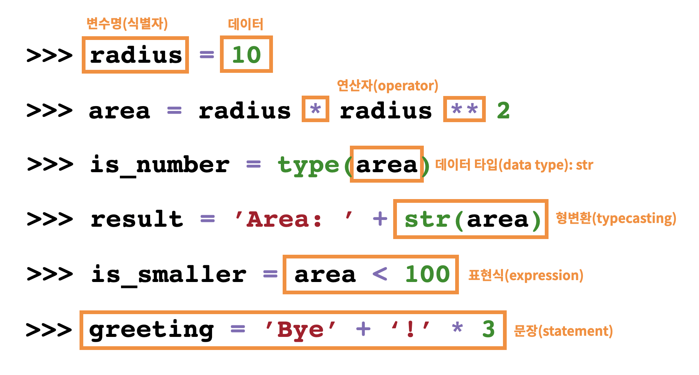

# 01.2. Python 연산자

[TOC]

## 1. 산술연산자

| 연산자 | 내용           |
| ------ | :------------- |
| +      | 덧셈           |
| -      | 뺄셈           |
| *      | 곱셈           |
| /      | 나눗셈         |
| //     | 몫             |
| %      | 나머지(modulo) |
| **     | 거듭제곱       |

- 나눗셈 (`/`) 은 항상 float를 돌려준다.
- 정수 나눗셈 으로 (소수부 없이) 정수 결과를 얻으려면 `//` 연산자를 사용

```python
print(5 / 2)
print(5 // 2)
print(int(5 / 2))
print(5 % 2)

#출력결과
2.5
2
2
1
```

- divmod 

```python
print(divmod(5, 2))
#(2, 1)

quotient, remainder = divmod(5, 2)
print(f'몫은 {quotient}, 나머지는 {remainder}')
#몫은 2, 나머지는 1
```


## 2. 비교 연산자

| 연산자   | 내용                   |
| -------- | ---------------------- |
| `<`      | 미만                   |
| `<=`     | 이하                   |
| `>`      | 초과                   |
| `>=`     | 이상                   |
| `==`     | 같음                   |
| `!=`     | 같지않음               |
| `is`     | 객체 아이덴티티        |
| `is not` | 부정된 객체 아이덴티티 |


## 3. 논리 연산자

| 연산자  | 내용                         |
| ------- | ---------------------------- |
| a and b | a와 b 모두 True시만 True     |
| a or b  | a 와 b 모두 False시만 False  |
| not a   | True -> False, False -> True |

``` python
print(True and True)
print(True and False)
print(False and True)
print(False and False)

#출력
True
False
False
False
```


#### 단축평가

- 첫 번째 값이 확실할 때, 두 번째 값은 확인 하지 않는다.
- 조건문에서 뒷 부분을 판단하지 않아도 되기 때문에 속도가 향상됨

```python
print(3 and 5)
print(3 and 0)
print(0 and 3)
print(0 and 0)

#출력
5
0
0
0
```


## 4. 복합 연산자

| 연산자  | 내용       |
| ------- | ---------- |
| a += b  | a = a + b  |
| a -= b  | a = a - b  |
| a *= b  | a = a * b  |
| a /= b  | a = a / b  |
| a //= b | a = a // b |
| a %= b  | a = a % b  |
| a **= b | a = a ** b |

- 복합 연산자는 연산과 대입이 함께 이루어진다.
- 반목문을 통해서 갯수를 카운트 할 때 많이 사용!

```python
cnt = 0
while cnt < 5:
    print(cnt)
    cnt += 1
    
#출력결과
0
1
2
3
4
```


---

## 5. 기타 주요 연산자

##### 1. Concatenation

> 숫자가 아닌 자료형에서도  `+`연산자를 통해 합칠 수 있다. 

```python
[1, 2, 3] + [4, 5, 6] #[1, 2, 3, 4, 5, 6]
'hi, ' + 'bye!'  #'hi, bye!'
```


##### 2. Containment Test

> `in` 연산자를 통해 특정 요소가 속해있는지 여부를 확인할 수 있다. 

```python
'a' in 'apple'  # True
1 in [1, 2, 3]  # True
```


##### 3. Identity

> `is` 연산자를 통해 동일한 객체(object) 인지 확인할 수 있다. 

```python
a = 3
b = 3
a is b  # True
print(id(a), id(b))  # 동일한 id 나옴
```

- 277 이후의 id 는 다르다. 

```python
c = 257
d = 257
c is d # False
print(id(c), id(d))  #다른 id 나옴
```

- 특정 변수가 비어있는지 확인하기 위해서는 

  `x == None` 이 아닌,  `x is None` 을 쓰는것을 권장.!


##### 4. Indexing/Slicing

> `[]`를 통한 값을 접근, `[:]` 를 통해 슬라이싱 할 수 있다. 

-> 컨테이너에 자세히 나옴..!!


## 6. 연산자 우선순위

1. `()`을 통한 grouping
2. Slicing
3. Indexing
4. 제곱연산자 `**`
5. 단항연산자 `+`, `-` (음수/양수 부호)
6. 산술연산자 `*`, `/`, `%`
7. 산술연산자 `+`, `-`
8. 비교연산자, `in`, `is`
9. `not`
10. `and`
11. `or`


## 7. 표현식(Expression) & 문장(Statement)

#### 1. 표현식

> 표현식 => `evaluate` => 값
>
> 표현식은 평가(evaluate) 되고, 값으로 변경

- 하나의 값(value)으로 환원(reduce)될 수 있는 문장을 의미한다.
- `식별자`, `값`(리터럴), `연산자`로 구성
- 표현식을 만드는 문법(syntax)은 일반적인 (중위표기) 수식의 규칙과 유사

```python
# 하나의 값(value)도 표현식(expression)이 될 수 있다.
'hello'
# 식별자가 값이 할당되어 있는 경우 수식의 일부가 될 수 있다.
radius = 10
3.14 * (radius - 5) ** 2

# 표현식 불가능
4 + 
```


#### 2. 문장

> 파이썬이 실행 가능한 최소한의 코드 단위
>
> 모든 표현식은 문장!!
>
> -> 표현식이 아닌 문장이 존재함  (ex. del 5)

```python
# 실행가능해야 하기 때문에 아래의 코드는 문장이 될 수 없다.
name = '
```



