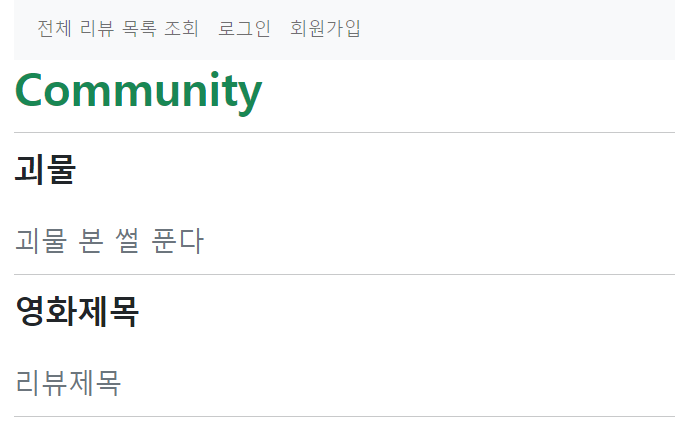
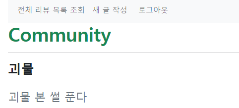
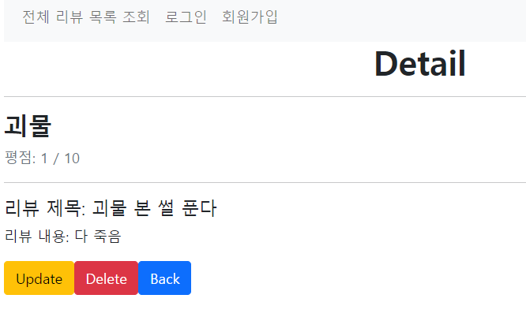
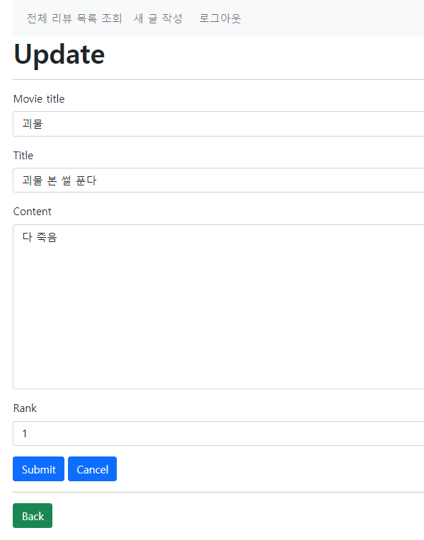
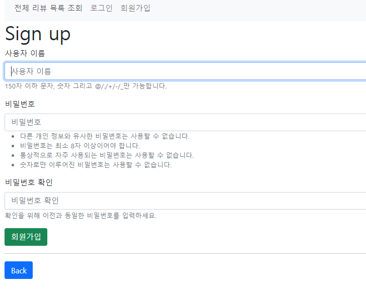
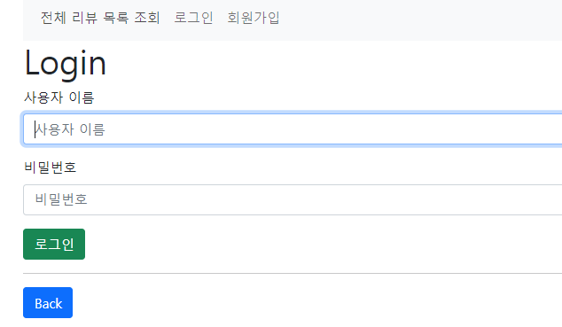

# 사용자 인증기반 웹 서비스 구현

> pjt06

## 1. 목표

- 데이터를 생성, 조회, 수정, 삭제할 수 있는 Web application 제작
- Django web framework를 통한 데이터 조작
- Authentication(사용자 인증)에 대한 이해

## 2. 준비사항

1. 언어

- Python 3.9+ 

- Django 3.2+

2. 도구

- Visual Studio Code

- Chrome Browser

## 3. 요구사항

> 커뮤니티 서비스의 회원관리 기능 개발을 위한 단계로, 사용자 인증상태에 따라 데이터의 생성, 조회, 수정, 삭제할 수 있는 기능을 완성
>
> 해당 기능은 향후 커뮤니티 서비스의 필수 기능으로 사용됨

1. 프로젝트 구조 

- `pjt05/`은 `startproject` 명령어로 생성되는 project 디렉토리
- `movies/`는 `startapp` 명령어로 생성되는 application 디렉토리

```
    pjt06/
       settings.py
       urls.py
		...
    templates/
       base.html
    accounts/
       migrations/
       templates/
       		accounts/
       			*.html
       models.py
       urls.py
       views.py
	   forms.py
	   ...
	community/
		migrations/
		templates/
			community/
				*.html
		forms.py
		models.py
		urls.py
		views.py
		...
    manage.py
    README.md
```


---

## 4. CODE

### 1. Pjt06_최상단파일

#### templates

##### base.html

1. 사용자의 인증 여부와 관계없이 전체 리뷰 목록 조회로 이동할 수 있는 링크를 표시

2. 사용자가 인증되어 있지 않다면, 로그인 페이지와 회원가입 페이지로 이동할 수 있는 링크를 표시

3. 사용자가 인증되어 있다면, 새로운 리뷰 작성페이지로 이동할 수 있 는 링크와 로그아웃 할 수 있는 링크를 표시

```django

...
    
    <title>Document</title>
<body>
<div class="container">
<nav class="navbar navbar-expand-lg navbar-light bg-light">
  <div class="container-fluid">
    <button class="navbar-toggler" type="button" data-bs-toggle="collapse" data-bs-target="#navbarSupportedContent" aria-controls="navbarSupportedContent" aria-expanded="false" aria-label="Toggle navigation">
      <span class="navbar-toggler-icon"></span>
    </button>
    <div class="collapse navbar-collapse" id="navbarSupportedContent">
      <ul class="navbar-nav me-auto mb-2 mb-lg-0">
            <li class="nav-item">
                <a class="nav-link" href="">전체 리뷰 목록 조회</a>
            </li>
        
            <li class="nav-item">
                <a class="nav-link" href="">새 글 작성</a>
            </li>
            <li class="nav-item">
                <form class="nav-link" action="" method="POST">
                    
                    <button class="nav-link btn btn-light border-0 py-0">로그아웃</button>
                </form>
            </li>
        
            <li class="nav-item">
                <a class="nav-link" href="">로그인</a>
            </li>
            <li class="nav-item">
                <a class="nav-link" href="">회원가입</a>
            </li>
        
      </ul>
    </div>
  </div>
</nav>
</div> 

    <div class="container">
        
    </div>
    
</body>
</html>
```

- `navbar` 내부에 if문으로 조건을 작성하여 사용자가 로그인된 경우/그렇지 않은 경우를 걸러내야 해서 어떤 방식으로 해야할지 조금 헤맸다.
- 그러나, bootstrap을 가져와서 을 하고 보여주는 list를 다르게 하니 조건에 맞게 잘 나오는 걸 확인할 수 있었다.
- 로그아웃은 `form` 으로 받아와 `POST`인 경우에만 처리해야 하는데, 나머지는 `a` 태그라서 디자인이 잘 나오는데 `form` 내부에 있어서 그런지 button으로 따로 움직인다. 
- 디자인만 비슷하게 구성하였는데, 실제로 서비스를 만들때에는 어떻게 해야할지 조금 더 공부해야겠다!


---

### 3. community

#### 1. models.py

```python
from django.db import models

class Community(models.Model):
    movie_title = models.CharField(max_length=100)
    title = models.CharField(max_length=100)
    content = models.TextField()
    rank = models.IntegerField()

    def __str__(self):
        return f'{self.movie_title}_{self.title}'
```

- 기존 CRUD를 할 때 많이 해왔던 양식이라 쉽게 할 수 있었다. 
- `rank` 에서 `IntegerField` 를 처음 써봐서 다양한 필드가 있다는 것을 알 수 있었다. 


#### 2. urls.py, forms.py, admin.py

- 기존 pjt05와 같아 쉽게 했던 것 같다. 

#### 3. views.py

```python
from community.forms import CommunityForm
from community.models import Community
from django.shortcuts import get_object_or_404, redirect, render
from django.views.decorators.http import require_http_methods, require_POST, require_safe
from django.contrib.auth.decorators import login_required

# Create your views here.
@require_safe
def index(request):
    community = Community.objects.all()
    context = {
        'community': community
    }
    return render(request, 'community/index.html', context)

@login_required
@require_http_methods(['GET', 'POST'])
def create(request):
    if request.method == 'POST':
        form = CommunityForm(request.POST)
        if form.is_valid():
            commu = form.save()
            return redirect('community:detail', commu.pk)
    else:
        form = CommunityForm()
    context = {
        'form': form,
    }
    return render(request, 'community/form.html', context)

@require_safe
def detail(request, pk):
    commu = get_object_or_404(Community, pk=pk)
    context = {
        'commu': commu,
    }
    return render(request, 'community/detail.html', context)

@login_required
@require_http_methods(['GET', 'POST'])
def update(request, pk):
    commu = get_object_or_404(Community, pk=pk)
    if request.method == 'POST':
        form = CommunityForm(request.POST, instance=commu)
        if form.is_valid():
            form.save()
            return redirect('community:detail', commu.pk)
    else:
        form = CommunityForm(instance=commu)
    context = {
        'commu': commu,
        'form': form,
    }
    return render(request, 'community/form.html', context)

@require_POST
def delete(request, pk):
    if request.user.is_authenticated:
        commu = get_object_or_404(Community, pk=pk)
        commu.delete()
    return redirect('community:index')
```

- `app`이름이 `community` 여서 복수가 아니기 때문에 변수 설정이 조금 헷갈렸다. 
- 앱 이름을 복수로 써야한다는 것을 완벽하게 체감하고 꼭! 복수로 설정해야하겠다고 다짐할 수 있었다!

> 로그인 검증 

- 유저 관리까지 같이 하는 페이지이기 때문에 로그인하지 않은 유저를 검증하는 과정을 거쳐야 했다. 
- 각 함수마다 method를 받는 조건이 다르기 때문에 GET과 POST 를 둘 다 받는 경우는 `@login_required` 를 작성하였고, 
  POST 만 받는 경우는 `is_authenticated` 속성을 사용하여 로그인 유저를 검증해 주었다. 
- `@login_required`에서 로그인 검증이 어떻게 되어 `next` 파라미터로 넘어가는지 헷갈렸는데, 다양한 접속을 해보고 자체적으로 데코레이터가 로그인 되어있는지 아닌지를 확인하여 넘겨준다는 걸 알게 되었다. 

#### 4. templates > comminity

##### 4.1. index.html, detail.html

- pjt05과 같은 방식으로 작성하였다.

##### 4.2. form.html

```django





    <h1 class="fw-bold">Create</h1>
    <hr>

    <h1 class="fw-bold">Update</h1>
    <hr>


<form action="" method="POST">
    
    
    
</form>
<hr>
<a class="btn btn-success" href="">Back</a>

```

- 중복을 최대한 없대기 위해 기존 `create.html` 과 `update.html` 을 `form.html`로 작성했어야 했다.
- 이 과정에서, if - else로 `request.resolver_match.url_name`를 검증했는데 정확히 resolver.name이 다른곳에 어떻게 사용되는지 이해는 하지 못하고 배운걸 따라 친것 같다. github을 보면서 다양한 시도를 해보고 싶다. 

- 또한, html파일을 같이 사용하기 때문에 `views`에서 return 할때의 html 도 모두 `form.html`로 변경해 작성하였다.


---

### 4. accounts

#### 1. urls.py

```python
from django.urls import path
from . import views

app_name = 'accounts'
urlpatterns = [
    path('signup/', views.signup, name='signup'),
    path('login/', views.login, name='login'),
    path('logout/', views.logout, name='logout'),
]
```

- 앱이 2개 이기 때문에 app_name의 진가를 발휘할 수 있게 되었다!
- 최상단 urls.py에 include를 하고 필요한 url을 app_name과 함께 작성했다.


#### 2. views.py

```python
from django.shortcuts import render, redirect
from django.contrib.auth.forms import AuthenticationForm, UserCreationForm
from django.contrib.auth import login as auth_login
from django.contrib.auth import logout as auth_logout
from django.views.decorators.http import require_http_methods, require_POST


@require_http_methods(['GET', 'POST'])
def signup(request):
    if request.user.is_authenticated:
        return redirect('community:index')

    if request.method == 'POST':
        form = UserCreationForm(request.POST)
        if form.is_valid():
            user = form.save()
            auth_login(request, user)
            return redirect('community:index')
    else:
        form = UserCreationForm()
    context = {
        'form': form,
    }
    return render(request, 'accounts/signup.html', context)

@require_http_methods(['GET', 'POST'])
def login(request):
    if request.user.is_authenticated:
        return redirect('community:index')

    if request.method == 'POST':
        form = AuthenticationForm(request, request.POST)
        if form.is_valid():
            auth_login(request, form.get_user())
            return redirect(request.GET.get('next') or 'community:index')
    else:
        form = AuthenticationForm()
    context = {
        'form': form,
    }
    return render(request, 'accounts/login.html', context)

@require_POST
def logout(request):
    auth_logout(request)
    return redirect('community:index')
```

- `Signup` - `UserCreationForm`
  - 회원가입을 하고 바로 로그인이 되게 하기 위해선 django에서 제공하는 `login`을 import 해서 `auth_login`으로 이름을 변경한 후 추가로 작성해야 한다.
  - 나머지는 `community > create` 와 로직이 비슷하다

- `login` - `AuthenticationForm`
  - 로그인을 할 때, `form.get_user()` 를 가져오는데, 이는 검증된 유저만 거치게 하기 위하여 위에서 변수에 저장한 form의 user를 불러오는 것이다. 
  - 그러나, 만약 request.user로 하였을 때 발생할 수 있는 구체적인 사례들을 더 알고싶어졌다. 아직 완벽하게 이해하지 못한것 같다. 😅

#### 3. templates > accounts

##### 3.1. signup.html, login.html

```django
<!-- signup.html -->




    <h1>Sign up</h1>
    <form action="" method="POST">
        
        
        <input class="btn btn-success" type="submit" value="회원가입">
    </form>
    <hr>
    <a class="btn btn-primary" href="">Back</a>

```

```django
<!-- login.html -->




    <h1>Login</h1>
    <form action="" method="POST">
        
        
        <input class="btn btn-success" type="submit" value="로그인">
    </form>
    <hr>
    <a href="" class="btn btn-primary">Back</a>


```

- html을 작성하는 것은 django에서 다른 form을 가져오는 것 외에는 `community` 에 있는 것과 크게 다르지 않아서 쉽게 작성할 수 있었다. 


---

## 5. 결과 화면

### 5.1.전체 리뷰 목록 조회 페이지  - 비로그인



### 5.1.0 전체 리뷰 목록 조회 페이지  - 로그인




### 5.2. 단일 리뷰 상세 조회




### 5.3. 기존 리뷰 수정



### 5.5. 회원가입



### 5.6 로그인



