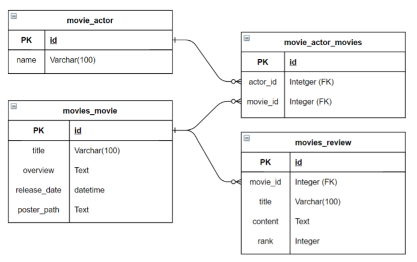
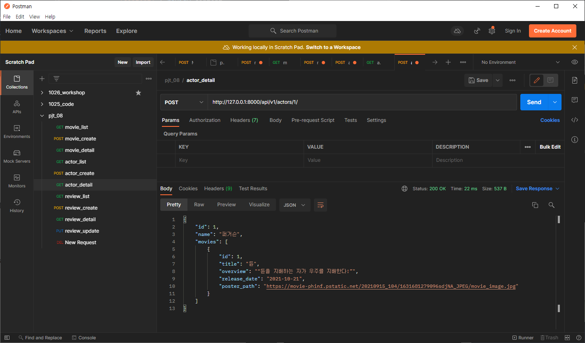
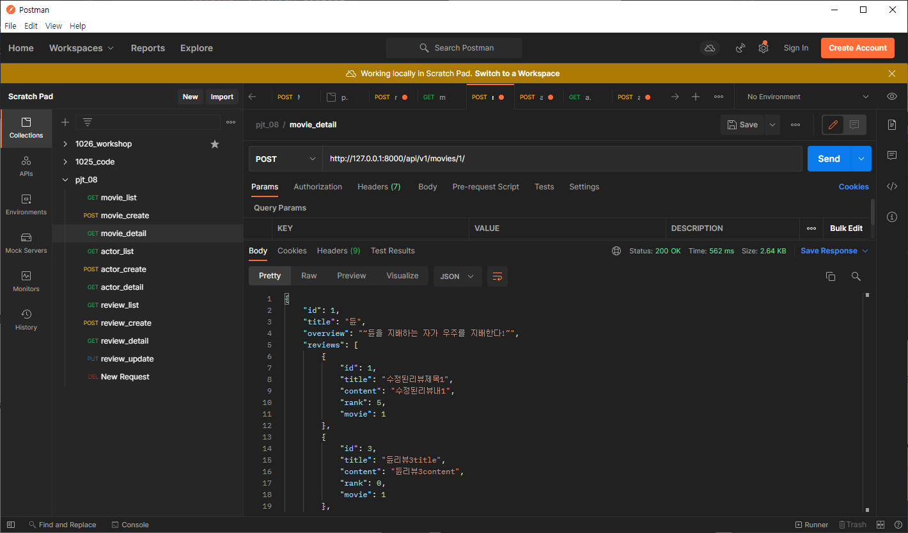
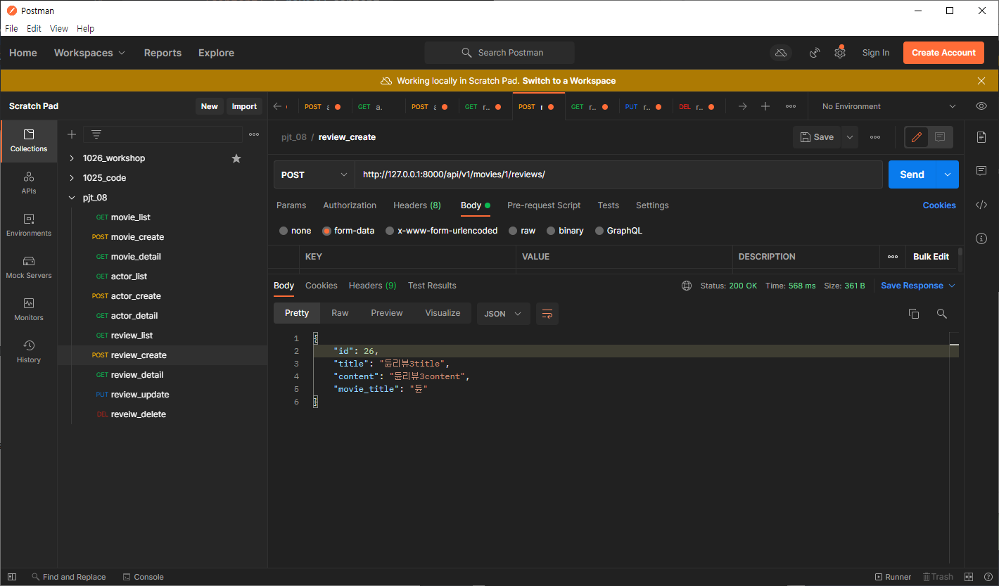
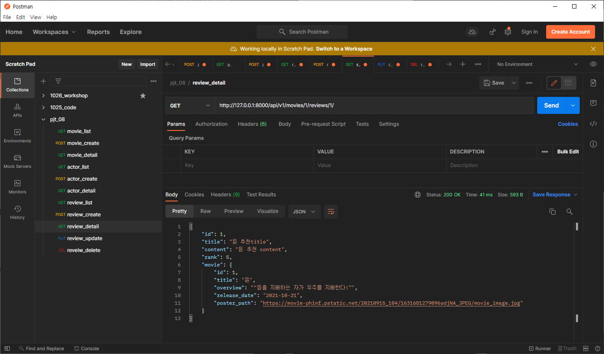
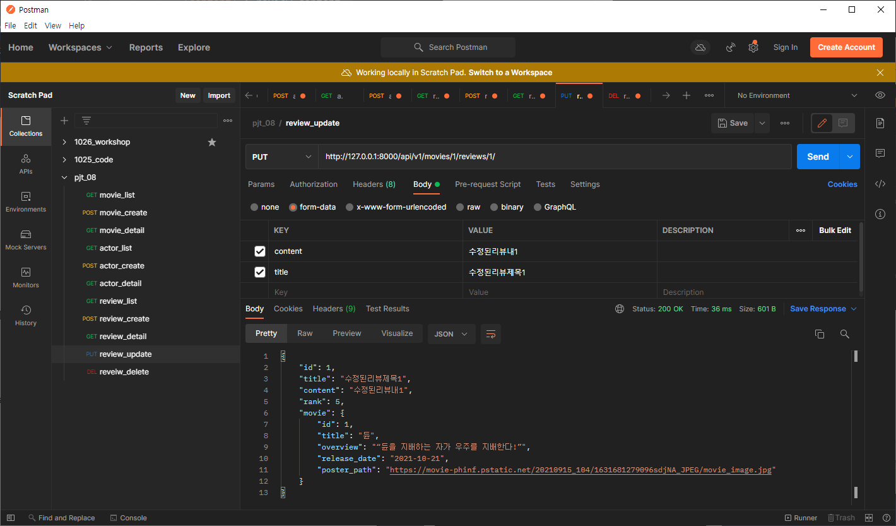

# 데이터베이스 설계를 통한 REST API 설계

## 1. 목표

- 데이터를 생성, 조회, 수정, 삭제할 수 있는 Web application 제작
- DRF(Django Rest Framework)를 통한 API Server 제작
- Database 1:N, M:N 관계의 이해와 데이터 관계 설정


## 2. 준비사항

1. 언어

- Python 3.9+ 

- Django 3.2+

2. 도구

- Visual Studio Code
- Chrome Browser
- Postman

## 3. 요구사항

> 커뮤니티 서비스의 상세 기능 개발을 위한 단계로, 모델간의 관계 설정 후 데이터의 생성, 조회, 수정, 삭제할 수 있는 기능을 완성한다. 데이터의 조회는 JSON 양식을 따른다.

##### 모델

> 데이터베이스에서 모델의 ERD(Entity-Relationship Diagram)은 아래와 같다.



## 4.CODE

### 4.0 Models.py

```python
from django.db import models

# Create your models here.
class Movie(models.Model):
    title = models.CharField(max_length=100)
    overview = models.TextField()
    release_date = models.DateField()
    poster_path = models.TextField()
    
    def __str__(self):
        return f'{self.title} - {self.overview[:20]}...'
        
class Actor(models.Model):
    movies = models.ManyToManyField(Movie, related_name='actors')
    name = models.CharField(max_length=100)

    def __str__(self):
        return self.name


class Review(models.Model):
    movie = models.ForeignKey(Movie, on_delete=models.CASCADE, related_name='reviews')
    title = models.CharField(max_length=100)
    content = models.TextField()
    rank = models.PositiveIntegerField(default=0)

    def __str__(self):
        return f'{self.title} - {self.rank}'
    
# movie - actor => movie_actor_movies 로  M:N
# movie - review  -> 1:N
```

### 4.1 Actor

#### 4.1.0 serializers/actor.py

```python
# 전체 배우 목록
class ActorListSerializer(serializers.ModelSerializer):

    class Meta:
        model = Actor
        fields = ('id', 'name',)

# 단일 배우 정보  -> 출연 영화 포함 
class ActorSerializer(serializers.ModelSerializer):

    class Meta:
        model = Actor
        fields = ('id', 'name', 'movies',)
        depth = 1
```

- `depth = 1` 을 설정하여  movies의  출현 영화의 정보가 모두 출력되도록 하였다. 

  처음에, `depth`를 생각하지 못하고 pk값만 출력이 되어서 조금 헤맸던 것 같다!

#### 4.1.1 urls.py

```python
   ...
    path('actors/', views.actor_list),
    path('actors/<int:actor_pk>/', views.actor_detail),
```

#### 4.1.2 views.py

```python
@api_view(['GET', 'POST'])
def actor_list(request):
    if request.method == 'GET':
        actors = get_list_or_404(Actor)
        serializer = ActorListSerializer(actors, many=True)
        return Response(serializer.data)

    elif request.method == 'POST':
        serializer = ActorSerializer(data=request.data)
        if serializer.is_valid(raise_exception=True):
            serializer.save()
            return Response(serializer.data, status=status.HTTP_201_CREATED)


@api_view(['POST'])
def actor_detail(request, actor_pk):
    actor = get_object_or_404(Actor, pk=actor_pk)
    serializer = ActorSerializer(actor)
    return Response(serializer.data)
```

---

### 4.2 Movie

#### 4.2.0 serializers/actor.py

```python
# 전체 영화 목록
class MovieListSerializer(serializers.ModelSerializer):

    class Meta:
        model = Movie
        fields = ('id', 'title',)


# 단일 영화 정보 
class MovieSerializer(serializers.ModelSerializer):

    class ReviewSerializer(serializers.ModelSerializer):
        class Meta:
            model = Review
            fields = '__all__'

    class ActorSerializer(serializers.ModelSerializer):
        class Meta:
            model = Actor
            fields = ('name',)

    # models.py 에서 역참조 하는 이름을 들고 여기 이름을 지정해야함. related_name으로 설정한 이름 들고오기 ! 아니면 . _set으로 되어있다. 
    reviews = ReviewSerializer(many=True, read_only=True) 
    actors = ActorSerializer(many=True, read_only=True)

    class Meta:
        model = Movie
        fields = ('id', 'title', 'overview', 'reviews', 'actors', 'release_date', 'poster_path',)

```

- `models.py`에서 Actor의 movies 에서 `relatedname`을 설정했는데 가져올때 역참조 이름으로 가져오지 않아서 오류가 발생했다.  정확히 `reviews`를 어디서 들고오는지 확실하게 알게 되는 계기가 된 것 같아 뿌듯했다.  

#### 4.2.1 urls.py

```python
   ...
    path('movies/', views.movie_list),
    path('movies/<int:movie_pk>/', views.movie_detail),
```

#### 4.2.2 views.py

```python
@api_view(['GET', 'POST'])
def movie_list(request):
    
    if request.method == 'GET':
        movies = get_list_or_404(Movie)
        serializer = MovieListSerializer(movies, many=True)
        return Response(serializer.data)
        
    elif request.method == 'POST':
        serializer = MovieSerializer(data=request.data)
        if serializer.is_valid(raise_exception=True):
            serializer.save()
            return Response(serializer.data)


@api_view(['POST'])
def movie_detail(request, movie_pk):
    movie = get_object_or_404(Movie, pk=movie_pk)
    serializer = MovieSerializer(movie)
    return Response(serializer.data)

```

---

### 4.3 Review

#### 4.3.0 serializers /review.py

```python
class ReviewListSerializer(serializers.ModelSerializer):

    class Meta:
        model = Review
        fields = ('id', 'title',)


class ReviewSerializer(serializers.ModelSerializer):

    class Meta:
        model = Review
        fields='__all__'
        depth = 1
```

#### 4.3.1 urls.py

```python
    ...
    path('reviews/', views.review_list),
    path('movies/<int:movie_pk>/reviews/', views.review_create),
    path('movies/<int:movie_pk>/reviews/<int:review_pk>/', views.review_detail),

```

#### 4.3.2 views.py

```python
@api_view(['GET'])
def review_list(request):
    reviews = get_list_or_404(Review)
    serializer = ReviewListSerializer(reviews, many=True)
    return Response(serializer.data)


@api_view(['POST'])
def review_create(request, movie_pk):
    movie = get_object_or_404(Movie, pk=movie_pk)
    serializer = ReviewSerializer(data = request.data)
    if serializer.is_valid(raise_exception=True):
        review = serializer.save(movie=movie)
        data = {
            'id': review.id,
            'title' : review.title,
            'content' : review.content,
            'movie_title' : movie.title
        }
        return Response(data)


@api_view(['GET', 'PUT', 'DELETE'])
def review_detail(request, review_pk, movie_pk):
    review = get_object_or_404(Review, pk=review_pk)
    if request.method == 'GET':
        serializer = ReviewSerializer(review)
        return Response(serializer.data)
        
    elif request.method == 'PUT':
        serializer = ReviewSerializer(review, data=request.data)
        if serializer.is_valid(raise_exception=True):
            serializer.save()
            return Response(serializer.data)
    
    elif request.method =='DELETE':
        review.delete()
        data = {
            'message': f'{review_pk}번 리뷰가 사라졌습니다.'
        }
        return Response(data, status=status.HTTP_204_NO_CONTENT)

```

- `review_detail` 페이지에서 movie의 정보가 나오도록 `depth=1`을 설정했는데, 전체 영화 data가 나와서 불필요한 정보를 수정해보았다.
- 초반에는, serializer에서 수정을 하려 하였지만, 실제 Foreignkey로 되어있는 데이터를 조작하는것이 어려워서 직접 views.py에서 보여지는 data를 원하는 데이터만 가져와서 보여질 수 있도록 수정하였다.

- 교수님께서 추천해주신 방법으로 data 에 dictionary형태로 수정을 하여 원하는 결과를 얻을 수 있었고, 팀원 분께서는 데이터 자체를 불러오는 것을 변화를 주셨다.

```python
@api_view(['POST'])
def review_create(request, movie_pk):
    movie = get_object_or_404(Movie, pk=movie_pk)
    serializer = ReviewSerializer(data = request.data)
    if serializer.is_valid(raise_exception=True):
        serializer.save(movie=movie)
        serializer_data = serializer.data.pop('movie')
        serializer_data['movie_title'] = movie.title
        return Response(serializer_data)
```

- 위와 같이, movie데이터를 없애서 저장을 한 후, `movie_title`이란 key에 `movie.title`을 value로 추가하는 방식으로 작성하셔서 데이터를 보여주거나 접근하는 다양한 방식에 대해 공부할 수 있었다.


> API 서버를 만들며 JSON으로 변환되는것을 확인하고, 다양한 데이터를 접해보면서 많은 시도를 해봤던 것 같다.
>
> 실제 API 서버를 만들어보았지만, 추후에 API 서버를 가져와서 역으로 Json 파일을 변환해서 사용하는 법도 꼭 해봐야겠다는 생각이 들었다.
>
> M:N관계와 역참조 부분이 많이 헷갈리긴 했지만, 팀원분과 같이 개념을 되짚어 보고, 시행착오들을 거쳐서 완성했던 프로젝트여서 더욱 많이 배우게 된 것 같다.


## 5. API test

### 5.1 Actor

> actor_detail



### 5.2 Movie

> movie_create


> movie_detail



### 5.3 Review

> review_create



> review_detail



> reveiw_update



